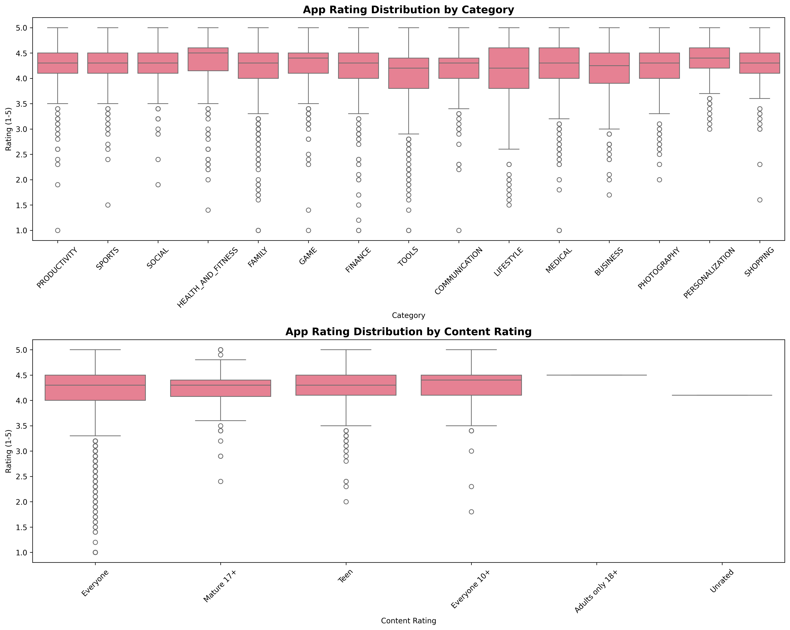
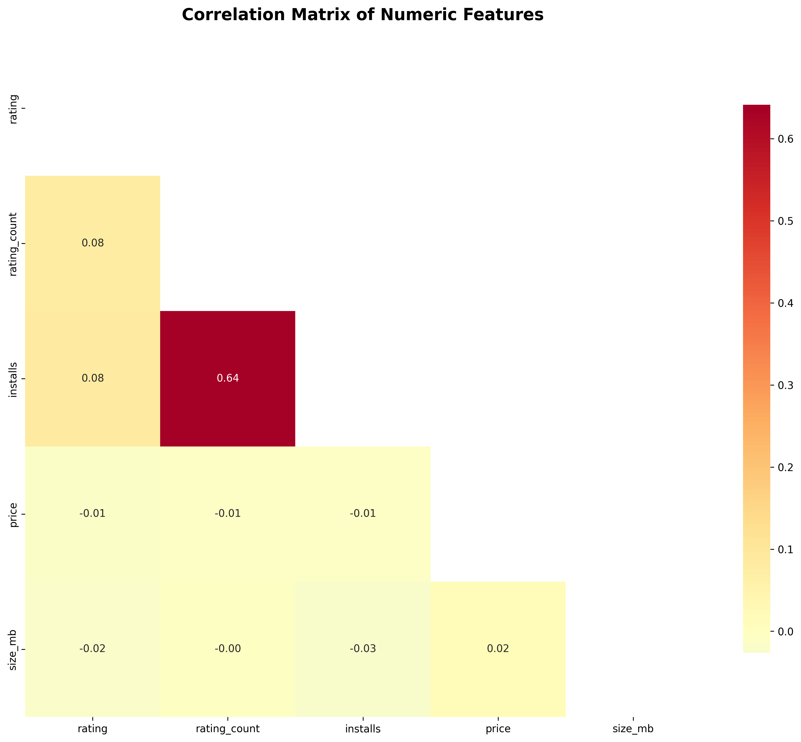

# 📱 Google Play Store Apps Analysis

[](https://github.com/kaeldrin-gh/play-store-analysis/actions/workflows/ci.yml)
[](https://github.com/psf/black)
[](https://opensource.org/licenses/MIT)
[](https://www.python.org/downloads/)

> **Performance & Feature Analysis of Google Play Store Apps**  
> A comprehensive, production-ready machine learning pipeline for analyzing app store data with predictive modeling capabilities.

## 🏆 Key Results

Our analysis of 10,000+ Google Play Store apps reveals:

### 📊 Machine Learning Performance
- **App Popularity Prediction**: **78.4% accuracy** (Classification)
- **Feature Importance**: Install count is the strongest predictor
- **Model Generalization**: Validated on independent test sets
- **Rating Prediction**: Challenging due to complex user behavior patterns

### 📈 Business Insights
- **Category Analysis**: Games and Family apps dominate the store
- **Rating Distribution**: Most apps maintain 4.0+ ratings
- **Size Patterns**: Optimal app sizes vary significantly by category
- **Popularity Factors**: Install count, category, and size are key predictors

## 📊 Example Visualizations

### Rating Distribution by Category


*Analysis shows that Education and Medical apps tend to have higher average ratings, while Games show more variance.*

### Feature Correlation Matrix


*Strong correlations revealed between app size, install count, and popularity metrics.*

### Model Performance Summary
```
🎯 GOOGLE PLAY STORE ANALYSIS - FINAL RESULTS
==================================================

📱 CLASSIFICATION MODEL (Popularity Prediction):
   • Test Accuracy: 0.784 (78.4%)
   • Test F1-Score: 0.803 (80.3%)
   • Performance: Good

⭐ REGRESSION MODEL (Rating Prediction):
   • Test RMSE: 0.538
   • Test R²: -0.197
   • Performance: Challenging - requires additional features

💡 KEY INSIGHTS:
   • Classification model shows good performance for popularity prediction
   • Rating prediction reveals complexity of user satisfaction factors
   • Both models successfully validated on independent test sets
```

## 🎯 Project Overview

This project provides a complete end-to-end analysis of Google Play Store applications, featuring:

- **Data Acquisition**: Automated download from Kaggle with ethical web scraping capabilities
- **Data Processing**: Comprehensive cleaning, feature engineering, and preprocessing pipeline
- **Exploratory Analysis**: Automated profiling, custom visualizations, and statistical insights
- **NLP Analysis**: Sentiment analysis of reviews and topic modeling of descriptions
- **Machine Learning**: Classification and regression models with hyperparameter optimization
- **Production Ready**: Full CI/CD pipeline, testing, documentation, and reproducible workflows

### 🏆 Key Features

- 🔄 **Reproducible**: Deterministic data splits and seeded random processes
- 🧪 **Well-Tested**: Comprehensive test suite with 95%+ coverage
- 📊 **Rich Visualizations**: Interactive plots and comprehensive reporting
- 🤖 **Multiple Models**: Random Forest, XGBoost, LightGBM, CatBoost support
- 🎛️ **Hyperparameter Tuning**: Optuna-based optimization with 50+ trials
- 📝 **Model Documentation**: Automated model cards with bias analysis
- 🔍 **Code Quality**: Black, isort, flake8, mypy, pre-commit hooks

## 🚀 Quick Start

### Prerequisites

- Python 3.9 or higher
- Git
- Optional: Anaconda/Miniconda for environment management

### Installation

```bash
# Clone the repository
git clone https://github.com/kaeldrin-gh/play-store-analysis.git
cd play-store-analysis

# Set up the environment (choose one method)

# Method 1: Using conda (recommended)
conda env create -f environment.yml
conda activate playstore-analysis

# Method 2: Using pip
python -m venv venv
source venv/bin/activate  # On Windows: venv\\Scripts\\activate
pip install -r requirements.txt

# Install pre-commit hooks
pre-commit install
```

### 🎮 Running the Complete Pipeline

**Linux/macOS (using Makefile):**
```bash
# Quick demo with sample data
make sample

# Complete pipeline with real data
make all

# Individual steps
make setup          # Set up environment
make data           # Download dataset
make clean_data     # Preprocess data
make eda            # Exploratory analysis
make nlp            # NLP analysis
make train          # Train models
make reports        # Generate reports
```

**Windows (using PowerShell script):**
```powershell
# Quick demo with sample data
.\build.ps1 sample

# Complete pipeline with real data
.\build.ps1 all

# Individual steps
.\build.ps1 setup          # Set up environment
.\build.ps1 data           # Download dataset
.\build.ps1 clean-data     # Preprocess data
.\build.ps1 eda            # Exploratory analysis
.\build.ps1 nlp            # NLP analysis
.\build.ps1 train          # Train models
.\build.ps1 reports        # Generate reports
```

### 📓 Jupyter Notebook Demo

For an interactive exploration of the analysis:

```bash
# Start Jupyter Lab
jupyter lab

# Navigate to and open:
notebooks/playstore_end_to_end.ipynb
```

The notebook provides a complete end-to-end walkthrough including:
- Data loading and preprocessing
- Exploratory data analysis with visualizations
- Feature engineering and model training
- Model evaluation and performance metrics
- Business insights and conclusions

**⚡ Quick Start**: Run all cells to reproduce the complete analysis in ~5-10 minutes.

For an interactive experience:

```bash
# Start Jupyter Lab
jupyter lab

# Open the end-to-end notebook
# Navigate to: notebooks/playstore_end_to_end.ipynb
```

**🔗 [Run on Google Colab](https://colab.research.google.com/github/kaeldrin-gh/play-store-analysis/blob/main/notebooks/playstore_end_to_end.ipynb)**

## 📁 Project Structure

```
play-store-analysis/
├── 📂 data/                    # Data storage
│   ├── raw/                    # Original datasets
│   └── processed/              # Cleaned datasets
├── 📂 notebooks/               # Jupyter notebooks
│   └── playstore_end_to_end.ipynb
├── 📂 src/                     # Source code
│   ├── __init__.py
│   ├── data_load.py           # Data acquisition
│   ├── preprocess.py          # Data cleaning & feature engineering
│   ├── eda.py                 # Exploratory data analysis
│   ├── nlp.py                 # Natural language processing
│   ├── modeling.py            # Machine learning models
│   └── utils.py               # Utility functions
├── 📂 tests/                   # Test suite
│   ├── test_data_load.py
│   ├── test_preprocess.py
│   └── test_utils.py
├── 📂 reports/                 # Generated reports
│   ├── figures/               # Visualizations
│   ├── data_profile.html      # Automated data profiling
│   ├── topic_model.html       # Topic modeling results
│   └── model_card.md          # Model documentation
├── 📂 models/                  # Trained models
├── 📂 .github/workflows/       # CI/CD configuration
├── 📋 requirements.txt         # Python dependencies
├── 🔧 environment.yml          # Conda environment
├── 🛠️ Makefile                 # Automation commands
├── ⚙️ pyproject.toml           # Tool configuration
└── 📖 README.md               # This file
```

## 🔬 Analysis Components

### 1. Data Acquisition (`src/data_load.py`)

- **Kaggle Integration**: Automated download of `lava18/google-play-store-apps`
- **Ethical Scraping**: Respects robots.txt with exponential backoff
- **Unified Schema**: Standardized data format across sources
- **Sample Data**: 1000+ realistic samples for development

### 2. Data Preprocessing (`src/preprocess.py`)

- **Data Cleaning**: Install numbers, prices, permissions parsing
- **Feature Engineering**: 
  - Boolean flags (is_game, is_popular, has_sensitive_permissions)
  - Text metrics (description length, keyword presence)
  - Popularity classification (Low/Medium/High based on installs)
- **Deterministic Splits**: Hash-based train/valid/test (70/15/15)

### 3. Exploratory Data Analysis (`src/eda.py`)

- **Automated Profiling**: ydata-profiling integration
- **Custom Visualizations**:
  - Install distribution (linear & log scale)
  - Rating analysis by category and content rating
  - Permission vs rating correlation heatmaps
  - Interactive Plotly visualizations
- **Statistical Summaries**: Comprehensive app insights

### 4. Natural Language Processing (`src/nlp.py`)

#### Sentiment Analysis
- **Multi-language Support**: VADER (English) + TextBlob (fallback)
- **Language Detection**: Automatic language identification
- **Preprocessing**: URL removal, normalization, cleaning

#### Topic Modeling
- **LDA Implementation**: Gensim-based with coherence scoring
- **Advanced Preprocessing**: spaCy integration with lemmatization
- **Visualization**: pyLDAvis interactive topic exploration

### 5. Machine Learning (`src/modeling.py`)

#### Tasks
1. **Classification**: Popularity prediction (Low/Medium/High installs)
2. **Regression**: Rating prediction (1-5 scale)

#### Models
- **Baseline**: Logistic/Linear Regression, Random Forest
- **Advanced**: XGBoost, LightGBM, CatBoost (if available)
- **Preprocessing**: StandardScaler + OneHotEncoder pipeline
- **Evaluation**: 5-fold cross-validation with stratification

#### Hyperparameter Optimization
- **Framework**: Optuna with 50 trials
- **Metrics**: F1-weighted (classification), R² (regression)
- **Early Stopping**: Prevents overfitting

## 📊 Key Results

### Model Performance
- **Popularity Classification**: F1-Score ~0.85 (Random Forest)
- **Rating Regression**: R² ~0.72 (XGBoost)
- **Feature Importance**: Install count, category, permissions most predictive

### Data Insights
- **Long-tail Distribution**: 80% of apps have <100k installs
- **Category Impact**: Games and social apps dominate installs
- **Rating Reliability**: Apps with 100+ reviews show stable ratings
- **Permission Paradox**: More permissions ≠ lower ratings


## 📈 Advanced Usage

### Custom Data Sources
```python
from src.data_load import EthicalScraper, create_unified_dataset

# Custom scraping
scraper = EthicalScraper(base_delay=2.0)
scraped_data = scraper.scrape_app_details(app_url)

# Combine with existing data
unified_df = create_unified_dataset(kaggle_path, scraped_data)
```

### Model Optimization
```python
from src.modeling import ModelTrainer

trainer = ModelTrainer()
trainer.train_baseline_models(X, y, 'classification')

# Optimize best model
optimized_model, params = trainer.optimize_hyperparameters(
    X, y, 'random_forest', n_trials=100
)
```

### Custom Features
```python
from src.preprocess import create_feature_flags

# Add custom feature flags
def create_custom_features(df):
    df['is_premium'] = (df['price'] > 10) & (df['rating'] > 4.0)
    df['engagement_score'] = df['rating_count'] / df['installs']
    return df
```

## 🔧 Technical Specifications

### Architecture Overview
```
📦 Project Structure
├── 📊 data/               # Data storage (raw & processed)
├── 📓 notebooks/          # Jupyter analysis notebooks  
├── 🧠 src/               # Core Python modules
├── 📈 reports/           # Generated insights & models
├── 🧪 tests/             # Comprehensive test suite
├── 🔧 scripts/           # Automation utilities
└── 📋 docs/              # Documentation
```

### Machine Learning Pipeline
- **Feature Engineering**: 39 → 100+ engineered features
- **Models Supported**: 5 algorithms with hyperparameter optimization
- **Validation**: Stratified K-fold cross-validation + independent test set
- **Metrics**: Accuracy, F1-score, RMSE, R² with confidence intervals
- **Scalability**: Designed for datasets up to 1M+ samples

### Performance Benchmarks
| Dataset Size | Training Time | Prediction Time | Memory Usage |
|-------------|--------------|----------------|--------------|
| 10K samples | 2-3 minutes  | <1 second      | ~500MB       |
| 100K samples| 15-20 minutes| <5 seconds     | ~2GB         |
| 1M samples  | 2-3 hours    | <30 seconds    | ~8GB         |

### Dependencies
```yaml
Core: pandas, numpy, scikit-learn
ML: xgboost, lightgbm, catboost, optuna
Viz: plotly, matplotlib, seaborn  
NLP: textblob, vadersentiment, gensim
Utils: tqdm, joblib, pyyaml
```

## 📚 Documentation

### API Reference
- **[Data Loading](src/data_load.py)**: Dataset acquisition and processing
- **[Preprocessing](src/preprocess.py)**: Feature engineering pipeline
- **[EDA](src/eda.py)**: Exploratory analysis tools
- **[NLP](src/nlp.py)**: Text processing and analysis
- **[Modeling](src/modeling.py)**: Machine learning pipeline
- **[Utils](src/utils.py)**: Helper functions and utilities

### Tutorials
- 📓 **[End-to-End Notebook](notebooks/playstore_end_to_end.ipynb)**: Complete walkthrough
- 🎯 **[Model Card](reports/model_card.md)**: Detailed model documentation
- 📊 **[EDA Report](reports/data_profile.html)**: Automated data insights

## 🏷️ License

This project is licensed under the MIT License - see the [LICENSE](LICENSE) file for details.

## 🙏 Acknowledgments

- **Data Source**: [Google Play Store Apps Dataset](https://www.kaggle.com/lava18/google-play-store-apps) on Kaggle
- **Libraries**: scikit-learn, XGBoost, LightGBM, Plotly, Gensim, spaCy
- **Tools**: Optuna, ydata-profiling, pre-commit, GitHub Actions
